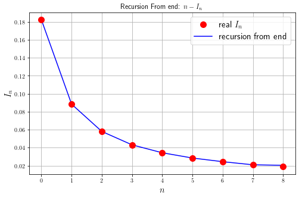

# 公式推导与真解

$$
\begin{equation}
  \begin{aligned}
    I_n&=\int_0^1\frac{x}{x+5}x^{n-1}dx\\
    &=\int_0^1 x^{n-1}dx - 5\int_{0}^1\frac{x_{n-1}}{x+5}dx\\
    &=\frac{1}{n}-5I_{n-1}
  \end{aligned}
\end{equation}
$$

因此对于推导而言，存在如上的递推关系。为了考量比较真实值和递推值，我们可以先使用 `SymPy` 推导出真正的解。


```python
import sympy as sp
import numpy as np
import matplotlib.pyplot as plt
import matplotlib as mpl
mpl.rcParams['text.usetex'] = True
```

让我们定义一些基本量，来进行计算：


```python
n = 8
n_range = np.array(range(0, n+1), dtype=int)
x_sym = sp.symbols("x")
expr = sp.Matrix([[x_sym**n_range[i] / (x_sym+5) for i in range(len(n_range))]])
expr.T
```


$\displaystyle \left[\begin{matrix}\frac{1}{x + 5}\\\frac{x}{x + 5}\\\frac{x^{2}}{x + 5}\\\frac{x^{3}}{x + 5}\\\frac{x^{4}}{x + 5}\\\frac{x^{5}}{x + 5}\\\frac{x^{6}}{x + 5}\\\frac{x^{7}}{x + 5}\\\frac{x^{8}}{x + 5}\end{matrix}\right]$


因此看可以导出积分的精确解析表达式：


```python
expr_integrate = sp.integrate(expr, x_sym)
expr_integrate.T
```


$\displaystyle \left[\begin{matrix}\log{\left(x + 5 \right)}\\x - 5 \log{\left(x + 5 \right)}\\\frac{x^{2}}{2} - 5 x + 25 \log{\left(x + 5 \right)}\\\frac{x^{3}}{3} - \frac{5 x^{2}}{2} + 25 x - 125 \log{\left(x + 5 \right)}\\\frac{x^{4}}{4} - \frac{5 x^{3}}{3} + \frac{25 x^{2}}{2} - 125 x + 625 \log{\left(x + 5 \right)}\\\frac{x^{5}}{5} - \frac{5 x^{4}}{4} + \frac{25 x^{3}}{3} - \frac{125 x^{2}}{2} + 625 x - 3125 \log{\left(x + 5 \right)}\\\frac{x^{6}}{6} - x^{5} + \frac{25 x^{4}}{4} - \frac{125 x^{3}}{3} + \frac{625 x^{2}}{2} - 3125 x + 15625 \log{\left(x + 5 \right)}\\\frac{x^{7}}{7} - \frac{5 x^{6}}{6} + 5 x^{5} - \frac{125 x^{4}}{4} + \frac{625 x^{3}}{3} - \frac{3125 x^{2}}{2} + 15625 x - 78125 \log{\left(x + 5 \right)}\\\frac{x^{8}}{8} - \frac{5 x^{7}}{7} + \frac{25 x^{6}}{6} - 25 x^{5} + \frac{625 x^{4}}{4} - \frac{3125 x^{3}}{3} + \frac{15625 x^{2}}{2} - 78125 x + 390625 \log{\left(x + 5 \right)}\end{matrix}\right]$


进而看可以求出 $I_n$ 的真实值如下（取小数点后 $6$ 位）


```python
In_real_expr = expr_integrate.subs(x_sym, 1) - expr_integrate.subs(x_sym, 0)
In_real_expr.T
```


$\displaystyle \left[\begin{matrix}- \log{\left(5 \right)} + \log{\left(6 \right)}\\- 5 \log{\left(6 \right)} + 1 + 5 \log{\left(5 \right)}\\- 25 \log{\left(5 \right)} - \frac{9}{2} + 25 \log{\left(6 \right)}\\- 125 \log{\left(6 \right)} + \frac{137}{6} + 125 \log{\left(5 \right)}\\- 625 \log{\left(5 \right)} - \frac{1367}{12} + 625 \log{\left(6 \right)}\\- 3125 \log{\left(6 \right)} + \frac{34187}{60} + 3125 \log{\left(5 \right)}\\- 15625 \log{\left(5 \right)} - \frac{11395}{4} + 15625 \log{\left(6 \right)}\\- 78125 \log{\left(6 \right)} + \frac{398829}{28} + 78125 \log{\left(5 \right)}\\- 390625 \log{\left(5 \right)} - \frac{3988283}{56} + 390625 \log{\left(6 \right)}\end{matrix}\right]$


```python
dec = 6
np.set_printoptions(formatter={'float': ('{: 0.' + str(dec) + 'f}').format})
In_real = np.round(np.array(In_real_expr, dtype=float), dec)[0]
print(In_real)
```

    [ 0.182322  0.088392  0.058039  0.043139  0.034306  0.028468  0.024325
      0.021233  0.018837]
    

不妨绘制出这里的值：


```python
plt.figure(figsize=(8, 5), facecolor="white")
plt.scatter(n_range, In_real, s=100, color="red", zorder=10, label="real $I_n$")
plt.plot(n_range, In_real, color="blue", label="Connect by line")
plt.legend(loc="upper right", fontsize=15)
plt.xlabel("$n$", fontsize=15)
plt.ylabel("$I_n$", fontsize=15)
plt.grid(True)
plt.title("Real Solution for $n-I_n$")
plt.show()
```


    

    


# 从 $0$ 开始的递推

采用递推公式：

$$
I_n = \frac{1}{n}-5I_{n-1}
$$

每一步计算都保留小数点后 $6$ 位：


```python
In_from0 = np.zeros(n+1)
I0 = np.round(np.log(6/5), dec)
In_from0[0] = I0
I0
```


    0.182322


```python
for i in range(1, len(In_from0)):
    In_from0[i] = np.round(1/i - 5*In_from0[i-1], dec)
    pass
print(In_from0)
```

    [ 0.182322  0.088390  0.058050  0.043083  0.034585  0.027075  0.031292
     -0.013603  0.193015]
    

显然发现这里计算出现了负数值，计算发生了不稳定现象，这里绘图比较一下：


```python
plt.figure(figsize=(8, 5), facecolor="white")
plt.scatter(n_range, In_real, s=100, color="red", zorder=10, label="real $I_n$")
# plt.plot(n_range, In_real, color="blue", label="Connect by line")
plt.plot(n_range, In_from0, color="blue", label="recursion from beginning")
plt.legend(loc="upper right", fontsize=15)
plt.xlabel("$n$", fontsize=15)
plt.ylabel("$I_n$", fontsize=15)
plt.grid(True)
plt.title("Recursion From zero: $n-I_n$")
plt.show()
```


    

    


# 从尾开始的递推

反过来使用公式如下：

$$
I_{n-1}=\frac{1}{5}\left(
    \frac{1}{n}-I_n
\right)
$$

我们可以估计一下 $I_8$ 的值如下：

$$
I_8=\int_0^1 \frac{x^8}{x+5} dx
$$

因此：

$$
\frac{1}{6}\int_0^1 x^8dx \leq I_8 \leq \frac{1}{5}\int_0^1 x^8 dx
$$

显然可以估计范围如下：

$$
I_8 \in \left(
    \frac{1}{54},\frac{1}{45}
\right)
$$

给出其估计值如下：

$$
I_8\approx  \frac{1}{2}\left(\frac{1}{45}+\frac{1}{54}\right)=\frac{11}{18\times 5\times 6}
$$


```python
I8 = np.round(11/18/5/6, dec)
print(I8)
```

    0.02037
    

接下来从尾巴处进行递推如下：


```python
In_frome = np.zeros(n+1)
In_frome[-1] = I8
for i in range(1, len(In_frome)):
    In_frome[n-i] = np.round((1/(n-i+1) - In_frome[n-i+1])/5, dec)
    pass
print(In_frome)
```

    [ 0.182322  0.088392  0.058039  0.043138  0.034309  0.028456  0.024386
      0.020926  0.020370]
    

不难看出，似乎和真实值差的值不算大。。。因此画一下如下


```python
plt.figure(figsize=(8, 5), facecolor="white")
plt.scatter(n_range, In_real, s=100, color="red", zorder=10, label="real $I_n$")
# plt.plot(n_range, In_real, color="blue", label="Connect by line")
plt.plot(n_range, In_frome, color="blue", label="recursion from end")
plt.legend(loc="upper right", fontsize=15)
plt.xlabel("$n$", fontsize=15)
plt.ylabel("$I_n$", fontsize=15)
plt.grid(True)
plt.title("Recursion From end: $n-I_n$")
plt.show()
```


    

    


因此上述的计算表明一件事情，那就是采用误差不会放大的递推计算式子才能保证问题计算的精度，负责只会让误差放大到离谱的地步。与兴趣的同学可以更改程序中 `dec` 值，会发现从 $0$ 开始的递推很大程度上取决于 `dec` 的值。


